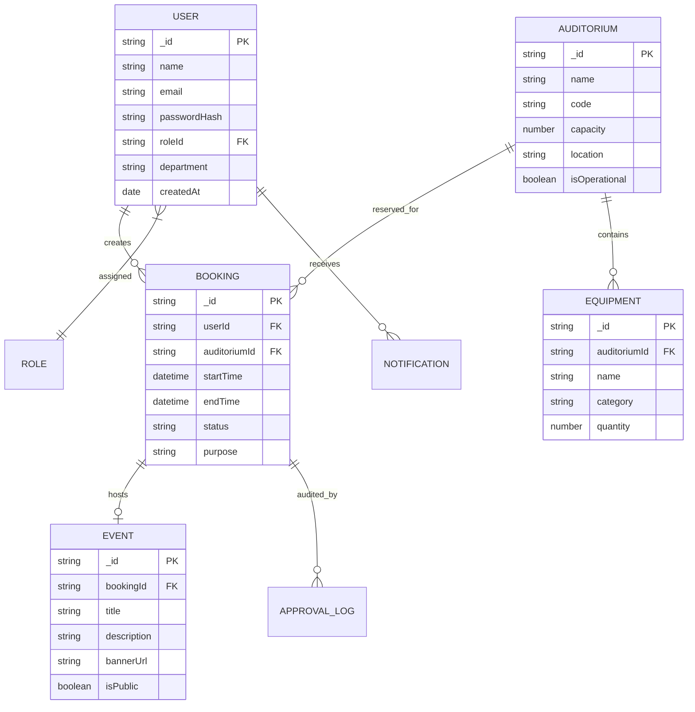

# Entity-Relationship Diagram (ERD)

## Smart Auditorium Booking & Management System (SABMS)

---

## 1. Domain Entity Relationship Map

---

## 2. Entity Cardinalities & Relational Rules

1. **User ↔ Booking**: One user can submit multiple booking requests (1 : N).
2. **Auditorium ↔ Booking**: An auditorium can host multiple scheduled bookings across non-overlapping time slots (1 : N).
3. **Auditorium ↔ Equipment**: An auditorium contains multiple assigned equipment items (1 : N).
4. **Booking ↔ Event**: An approved booking may optionally host a public event (1 : 1).

---

## 3. ERD Extension & Migration Log

- [ ] Sprint 2: User & Auth ERD Refinement
- [ ] Sprint 3: Auditorium & Equipment Schema Addition
- [ ] Sprint 4: Booking Engine SlotLock Schema Addition
