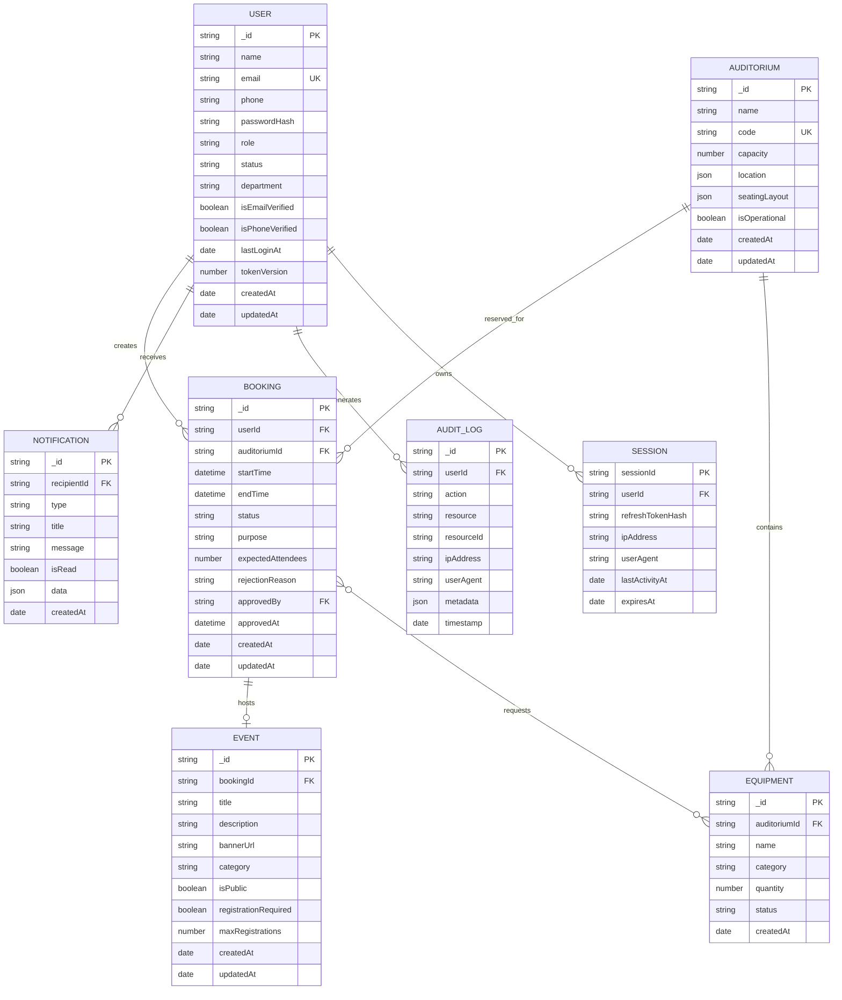

# Entity-Relationship Diagram (ERD)

## Smart Auditorium Booking & Management System (SABMS)

---

## 1. Domain Entity Relationship Map

---

## 2. Entity Cardinalities & Relational Rules

1. **User ↔ Booking (`1 : N`)**: A user can initiate multiple booking requests across different dates and times.
2. **User ↔ Session (`1 : N`)**: A user can maintain multiple concurrent active device sessions tracked in Redis and indexed for session management.
3. **Auditorium ↔ Booking (`1 : N`)**: An auditorium venue can host multiple sequential bookings, strictly constrained to non-overlapping time slots.
4. **Auditorium ↔ Equipment (`1 : N`)**: An auditorium owns multiple assigned AV, lighting, and physical equipment items.
5. **Booking ↔ Event (`1 : 1`)**: An approved booking may optionally host exactly one public event listing.
6. **Booking ↔ Equipment (`N : M`)**: A booking reservation can request multiple assigned equipment items.
7. **User ↔ Notification (`1 : N`)**: A user receives individualized booking updates and security alerts.
8. **User ↔ Audit Log (`1 : N`)**: User actions and state transitions trigger immutable audit log entries.

---

## 3. Relational Integrity & Deletion Rules

- **User Deactivation**: Hard deletion of active users is restricted. Inactive accounts are marked `status: 'DEACTIVATED'` to preserve historical booking and audit references.
- **Auditorium Maintenance**: Setting `isOperational: false` prevents new bookings without deleting historical reservations.
- **Booking Cancellation**: Bookings cannot be deleted from persistent storage; status is set to `CANCELLED` with timestamps for audit compliance.
