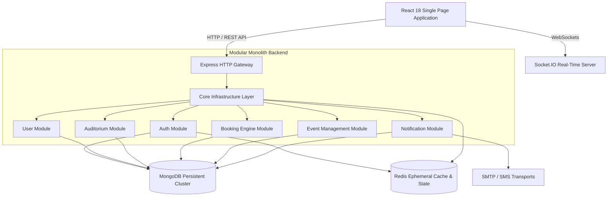

# High-Level Design (HLD)

## Smart Auditorium Booking & Management System (SABMS)

---

## 1. Architectural Overview

SABMS is architected as a **Modular Monolith** using the **MERN Stack** (MongoDB, Express.js, React, Node.js) paired with **Redis** for ephemeral caching and rate-limiting.

This design balances clean domain isolation with operational simplicity. All business modules reside within a single deployment unit (`server/src/modules/`), communicating through explicit service interfaces and internal event buses.

---

## 2. Core Architectural Principles

1. **Modular Monolith Placement**: All domain logic is grouped into self-contained feature modules under `server/src/modules/` without distributed microservice overhead.
2. **Layered Separation of Concerns**: Strict boundary rules ensure `Route → Validation → Controller → Service → Repository → Data Store`.
3. **Stateless API with Dual-Token Security**:
   - **Access Token**: Short-lived JSON Web Token (`JWT`, ~15 min lifetime) transmitted via `Authorization: Bearer <token>`.
   - **Refresh Token**: Long-lived cryptographically signed JSON Web Token (`JWT`, ~7 days lifetime) stored in `HttpOnly`, `SameSite=Strict`, `Secure` cookies (`Path=/api/v1/auth`) with single-use rotation and reuse theft detection.
4. **State Storage Partitioning**:
   - **MongoDB (Persistent)**: Long-term storage of user accounts, roles, venue metadata, bookings, and audit records.
   - **Redis (Ephemeral)**: OTP verification hashes (10 min registration / 5 min reset TTL), refresh token rotation families & session state (7 day TTL), failed login lockout counters, and JTI revocation blocklists.
5. **Zero-Trust Security Boundary**: Sensitive secrets, plaintext passwords, OTPs, and refresh tokens are never logged, never exposed to client JavaScript, and sanitized across all response and error pipelines.

---

## 3. System Context & Bounded Contexts

| Bounded Context     | Domain Boundary                                                             | Database Ownership                                         |
| :------------------ | :-------------------------------------------------------------------------- | :--------------------------------------------------------- |
| **`auth`**          | Identity provisioning, credential verification, OTP, JWT, session lifecycle | User, Role, Session collections; Redis OTP & Session store |
| **`users`**         | User profiles, account management, department associations                  | User collection                                            |
| **`auditoriums`**   | Venues, seating layouts, AV & physical equipment                            | Auditorium, Equipment collections                          |
| **`bookings`**      | Time-slot reservations, approval workflows, conflict detection              | Booking, SlotLock collections                              |
| **`events`**        | Public event listings, ticketing, schedules                                 | Event, Ticket collections                                  |
| **`notifications`** | Email delivery, SMS OTPs, WebSocket alerts, audit logging                   | Notification, AuditLog collections                         |

---

## 4. Technology Stack Rationale

- **Frontend**: React 18 + Vite (Fast HMR & lightweight bundling), Tailwind CSS (Consistent design system tokens), Zustand (Client state), TanStack Query (Server state synchronization).
- **Backend**: Node.js + Express.js 5 (High throughput I/O), Mongoose + MongoDB (Flexible document model for dynamic venue seating layouts).
- **Caching & Ephemeral Store**: Redis 7+ (`ioredis`) for high-speed TTL management, rate-limiting, and distributed locks.
- **Security & Cryptography**: Argon2id for password hashing, CSPRNG for OTP/token generation, Helmet for HTTP security headers.
- **Real-Time Communication**: Socket.IO for instant booking lock notifications and live calendar updates.

---

## 5. Architectural Quality Attributes

- **Maintainability**: Clear module boundaries, strict single-direction dependencies, and flat file layouts.
- **Security**: Defense-in-depth with Helmet headers, NoSQL injection sanitization, Argon2id hashing, rate limiting, and CORS origin whitelisting.
- **Scalability**: Stateless application tier allowing horizontal scaling behind load balancers with centralized MongoDB cluster and Redis cache.
- **Auditability**: Request correlation tracking via `X-Request-ID` across all Winston structured logs and API responses.
