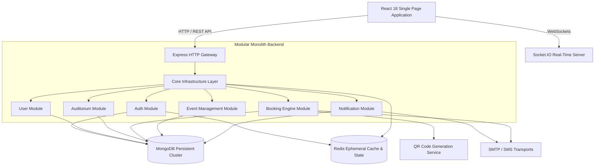
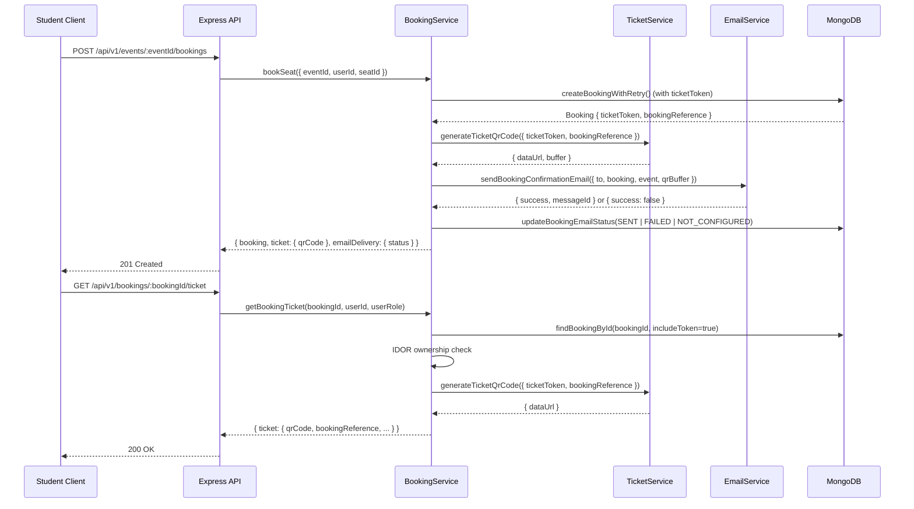

# High-Level Design (HLD)

## Smart Auditorium Booking & Management System (SABMS)

---

## 1. Architectural Overview

SABMS is architected as a **Modular Monolith** using the **MERN Stack** (MongoDB, Express.js, React, Node.js) paired with **Redis** for ephemeral caching and rate-limiting.

This design balances clean domain isolation with operational simplicity. All business modules reside within a single deployment unit (`server/src/modules/`), communicating through explicit service interfaces and internal event buses.



### 1.1 Ticket Generation & Email Confirmation Flow (Step 5)



---

## 2. Core Architectural Principles

1. **Modular Monolith Placement**: All domain logic is grouped into self-contained feature modules under `server/src/modules/` without distributed microservice overhead.
2. **Layered Separation of Concerns**: Strict boundary rules ensure `routes → controller → service → repository → database / Redis`:
   - **Routes (`*.routes.js`)**: Map HTTP verbs and endpoints; mount validation, rate-limiting, and guard middlewares. Must never contain business logic.
   - **Controllers (`*.controller.js`)**: Extract parameters, manage cookies, invoke services, and return standardized JSON envelopes. Must never directly query MongoDB or Redis.
   - **Services (`*.service.js`)**: Own domain logic, transaction orchestration, and security invariants. Must never depend on Express `req`/`res` objects.
   - **Repositories (`*.repository.js`)**: Encapsulate persistence queries and cache operations.
   - **Schemas (`*.schema.js`)**: Own strict request contract validation.
   - **Responses (`*.response.js`)**: Sanitize domain entities to prevent leaking sensitive fields (`passwordHash`, `__v`).
   - **Constants (`*.constants.js`)**: Define security policies, token lifespans, and configuration limits.
   - **Helpers (`*.helper.js`)**: Pure reusable cryptographic and utility helpers.
3. **Stateless API with Dual-Token Security**:
   - **Access Token**: Short-lived JSON Web Token (`JWT`, ~15 min lifetime) transmitted via `Authorization: Bearer <token>`, maintained strictly in client volatile memory via Zustand.
   - **Refresh Token**: Long-lived cryptographically signed JSON Web Token (`JWT`, ~7 days lifetime) stored in `HttpOnly`, `SameSite=Strict`, `Secure` cookies (`Path=/api/v1/auth`) with single-use rotation and reuse theft detection.
4. **State Storage Partitioning**:
   - **MongoDB (Persistent)**: Long-term storage of user accounts, roles, venue metadata, bookings, and audit records. Persistent refresh token families and session lineage reside in the `refresh_tokens` collection (`refresh-token.model.js`), justified as an authoritative auth domain entity.
   - **Redis (Ephemeral)**: OTP verification hashes (10 min registration / 5 min reset TTL), atomic OTP attempt counters (`auth:otp:<type>:attempts:<target>`), cooldowns (60s), refresh token rotation families & session state (7 day TTL), failed login lockout counters (15m), and JTI revocation blocklists.
5. **Zero-Trust Security Boundary**: Sensitive secrets, plaintext passwords, OTPs, and refresh tokens are never logged, never exposed to client JavaScript, and sanitized across all response and error pipelines.

---

## 3. System Context & Bounded Contexts

| Bounded Context     | Domain Boundary                                                                                                                                                          | Database Ownership                                                                                                  |
| :------------------ | :----------------------------------------------------------------------------------------------------------------------------------------------------------------------- | :------------------------------------------------------------------------------------------------------------------ |
| **`auth`**          | Identity provisioning, credential verification, OTP, JWT, session lifecycle                                                                                              | `User` (credentials), `RefreshToken` (`refresh-token.model.js` domain model) collections; Redis OTP & Session store |
| **`users`**         | User profiles, account management, department associations                                                                                                               | User collection                                                                                                     |
| **`auditoriums`**   | Venues, seating layouts, AV & physical equipment                                                                                                                         | Auditorium, Equipment collections                                                                                   |
| **`bookings`**      | Single-seat atomic reservation, compound unique indexes (`eventId + seatId`, `eventId + user`), server-derived auditorium, confirmation state machine, conflict recovery | Booking collection                                                                                                  |
| **`events`**        | Public event directory, student event details, authoritative schedule and venue metadata                                                                                 | Event collection                                                                                                    |
| **`notifications`** | Email delivery, SMS OTPs, WebSocket alerts, audit logging                                                                                                                | Notification, AuditLog collections                                                                                  |

### 3.1 Booking Confirmation & Success Flow (Step 4)

```
Student Client (React)                 SABMS Backend API                     MongoDB Database
       |                                      |                                     |
       |--- 1. Selects Seat (C-04) ---------->|                                     |
       |    [Booking Summary Rendered]        |                                     |
       |                                      |                                     |
       |--- 2. Clicks Confirm Booking ------->|                                     |
       |    [Button: "Booking..." Disabled]   |                                     |
       |    POST /api/v1/events/:id/bookings  |                                     |
       |    { seatId: "C-04" }                |--- 3. Validate student auth, ------->|
       |                                      |       time window, and seat config  |
       |                                      |--- 4. Insert with unique indexes -->|
       |                                      |       (atomic duplicate protection) |
       |                                      |<-- 5. Saved Booking Document -------|
       |<-- 6. HTTP 201 Created --------------|                                     |
       |    { bookingReference, status, ... } |                                     |
       |                                      |                                     |
       |=== 7. Render Success Card ===========|                                     |
       |    (Reference, Status: CONFIRMED,    |                                     |
       |     Event, Auditorium, Seat, Date)   |                                     |
```

---

## 4. Technology Stack Rationale

- **Frontend**: React 18 + Vite (Fast HMR & lightweight bundling), Tailwind CSS (Consistent design system tokens), Zustand (Client state strictly in memory; zero tokens in Web Storage), TanStack Query (Server state synchronization).
- **Backend**: Node.js + Express.js 5 (High throughput I/O), Mongoose + MongoDB (Flexible document model for dynamic venue seating layouts).
- **Caching & Ephemeral Store**: Redis 7+ (`ioredis`) for high-speed TTL management, atomic rate-limiting/attempt counters via Redis `INCR`, and distributed locks.
- **Security & Cryptography**: Argon2id for password hashing, CSPRNG for OTP/token generation, Helmet for HTTP security headers, double-submit CSRF with HMAC signatures.
- **Real-Time Communication**: Socket.IO for instant booking lock notifications and live calendar updates.

---

## 5. Architectural Quality Attributes

- **Maintainability**: Clear module boundaries, strict single-direction dependencies, and flat file layouts.
- **Security**: Defense-in-depth with Helmet headers, NoSQL injection sanitization, Argon2id hashing, rate limiting, and CORS origin whitelisting.
- **Scalability**: Stateless application tier allowing horizontal scaling behind load balancers with centralized MongoDB cluster and Redis cache.
- **Auditability**: Request correlation tracking via `X-Request-ID` across all Winston structured logs and API responses.

---

## 6. Document Revision & Acceptance History

| Version  | Date       | Author                    | Description                                                                 |
| :------- | :--------- | :------------------------ | :-------------------------------------------------------------------------- |
| `v1.0.0` | 2026-08-08 | Senior Software Architect | Initial HLD Architecture Baseline                                           |
| `v1.1.0` | 2026-09-07 | Senior Software Architect | Sprint 2 Final Acceptance Closure: Canonical Layer Separation & Auth Domain |
| `v1.2.0` | 2026-09-11 | Senior Software Architect | Step 5: QR Ticket Generation & Email Confirmation Architecture Flow         |
