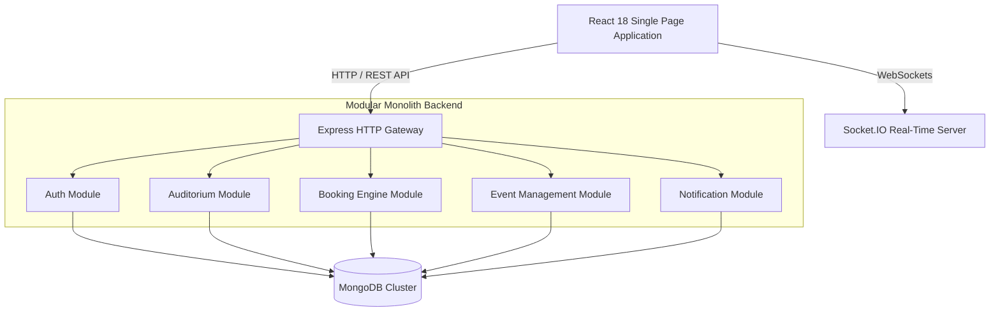

# High-Level Design (HLD)

## Smart Auditorium Booking & Management System (SABMS)

---

## 1. Architectural Overview

SABMS is architected as a **Modular Monolith** using the **MERN Stack** (MongoDB, Express.js, React, Node.js).

This design balances clean domain isolation with operational simplicity. All business modules reside within a single deployment unit (`server/src/modules/`), communicating through explicit service interfaces and internal event buses.

---

## 2. System Context & Bounded Contexts

| Bounded Context    | Domain Boundary                                       | Database Ownership                 |
| :----------------- | :---------------------------------------------------- | :--------------------------------- |
| **`auth`**         | Identity, Authentication, JWT, Roles & Permissions    | User, Role collections             |
| **`auditorium`**   | Venues, Seating layouts, AV Equipment                 | Auditorium, Equipment collections  |
| **`booking`**      | Time-slot reservations, Approval workflows, Conflicts | Booking, SlotLock collections      |
| **`event`**        | Public event listings, Ticketing, Schedules           | Event, Ticket collections          |
| **`notification`** | Email delivery, WebSockets alerts, Audit logging      | Notification, AuditLog collections |

---

## 3. Technology Stack Rationale

- **Frontend**: React 18 + Vite (Fast HMR & lightweight bundling), Tailwind CSS (Consistent design system tokens), Zustand (Client state), TanStack Query (Server state synchronization).
- **Backend**: Node.js + Express.js (High throughput I/O), Mongoose + MongoDB (Flexible document model for dynamic venue seating layouts).
- **Real-Time Communication**: Socket.IO for instant booking lock notifications and live calendar updates.

---

## 4. Module Expansion Register

- [ ] Auth Module HLD Details
- [ ] Auditorium Module HLD Details
- [ ] Booking Engine HLD Details
- [ ] Event Management HLD Details
- [ ] Notification Module HLD Details
