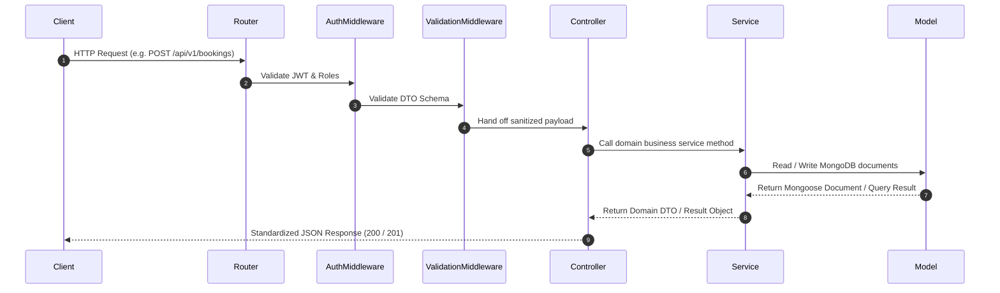

# Low-Level Design (LLD)

## Smart Auditorium Booking & Management System (SABMS)

---

## 1. Internal Module Architecture

Every module inside `server/src/modules/<module_name>/` follows the **Controller-Service-Repository / Model** design pattern:

```text
modules/<module_name>/
├── controllers/      # HTTP request handling & status response formatting
├── services/         # Pure business logic & transactional orchestration
├── models/           # Mongoose schemas & data access methods
├── routes/           # Express router endpoints
├── dtos/             # Data Transfer Objects & validation rules
└── tests/            # Module unit and integration tests
```

---

## 2. Standardized Request Lifecycle



---

## 3. Global Error Handling Contract

All application errors extend a base `AppError` class containing HTTP status codes and operational flags:

```javascript
class AppError extends Error {
  constructor(message, statusCode) {
    super(message);
    this.statusCode = statusCode;
    this.status = `${statusCode}`.startsWith('4') ? 'fail' : 'error';
    this.isOperational = true;
  }
}
```

---

## 4. Module LLD Expansion Register

- [ ] `auth` module LLD class specs & sequence diagrams
- [ ] `auditorium` module LLD class specs & sequence diagrams
- [ ] `booking` module LLD class specs & sequence diagrams
- [ ] `event` module LLD class specs & sequence diagrams
- [ ] `notification` module LLD class specs & sequence diagrams
