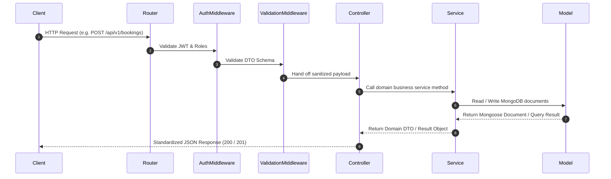

# Low-Level Design (LLD)

## Smart Auditorium Booking & Management System (SABMS)

---

## 1. Internal Module Architecture

Every module inside `server/src/modules/<module_name>/` follows the clean **Feature/Module Based Architecture** with flat files:

```text
modules/<module_name>/
├── <module>.routes.js       # Express router endpoints
├── <module>.controller.js   # HTTP request extraction & status response formatting
├── <module>.service.js      # Pure business logic & transactional orchestration
├── <module>.repository.js   # Encapsulated database queries & persistence
├── <module>.model.js        # Mongoose schemas & indexes (if module owns persistence)
├── <module>.schema.js       # Zod validation schemas
├── <module>.constants.js    # Module-specific constants
├── <module>.helper.js       # Module helper functions
└── <module>.response.js     # Data Transfer Objects & response sanitizers
```

---

## 2. Standardized Request Lifecycle



---

## 3. Global Error Handling Contract

All application errors extend a base `AppError` class containing HTTP status codes and operational flags:

```javascript
class AppError extends Error {
  constructor(message, statusCode) {
    super(message);
    this.statusCode = statusCode;
    this.status = `${statusCode}`.startsWith('4') ? 'fail' : 'error';
    this.isOperational = true;
  }
}
```

---

## 4. Module LLD Expansion Register

- [x] **`auth` module LLD class specs & sequence diagrams**: Refer to [`docs/modules/authentication/`](./modules/authentication/README.md)
- [ ] `auditorium` module LLD class specs & sequence diagrams
- [ ] `booking` module LLD class specs & sequence diagrams
- [ ] `event` module LLD class specs & sequence diagrams
- [ ] `notification` module LLD class specs & sequence diagrams
