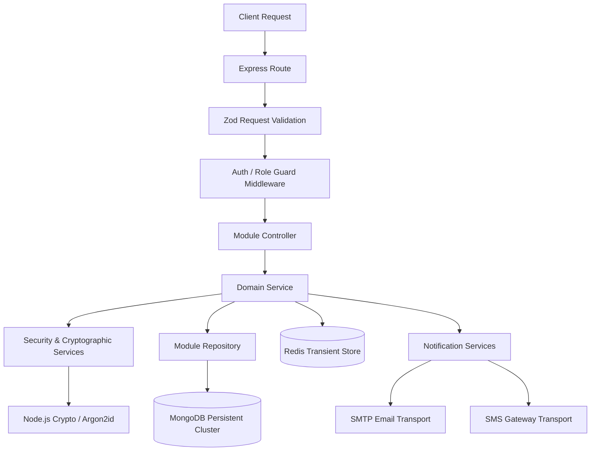
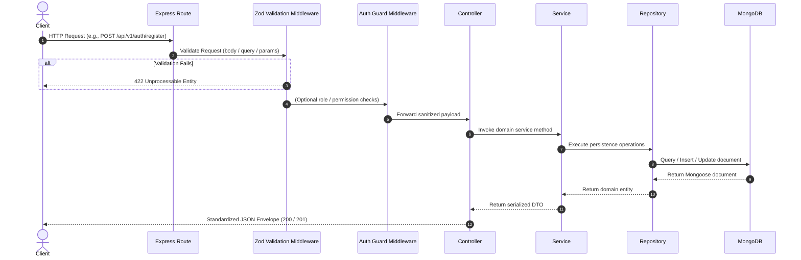

# Low-Level Design (LLD)

## Smart Auditorium Booking & Management System (SABMS)

---

## 1. Internal Module Architecture

Every module inside `server/src/modules/<module_name>/` follows the clean **Feature/Module Based Architecture** with flat files:

```text
server/src/
├── app/
│   ├── app.js               # Express application initialization & middleware stack
│   ├── routes.js            # Route discovery, API versioning & system routes
│   └── server.js            # HTTP server lifecycle, database connection & graceful shutdown
├── config/
│   ├── database.js          # MongoDB connection & connection state polling
│   └── env.config.js        # Zod environment variable validation & configuration
├── core/
│   ├── errors/              # AppError class hierarchy & error factories
│   ├── logger/              # Winston structured logging & daily log rotation
│   ├── middleware/          # Security, request ID, error handler & validation middleware
│   └── response/            # Standardized ApiResponse envelope handler
├── modules/
│   ├── auth/                # Authentication module (Flat 8-file layout)
│   │   ├── auth.constants.js
│   │   ├── auth.controller.js
│   │   ├── auth.helper.js
│   │   ├── auth.repository.js
│   │   ├── auth.response.js
│   │   ├── auth.routes.js
│   │   ├── auth.schema.js
│   │   └── auth.service.js
│   └── users/               # Users module (Flat layout)
│       ├── user.model.js
│       ├── user.repository.js
│       ├── user.routes.js
│       └── user.schema.js
├── services/
│   ├── email.service.js     # Nodemailer SMTP email verification dispatch
│   ├── password.service.js  # Argon2id password hashing & policy verification
│   └── sms.service.js       # SMS verification transport & provider adapter
└── shared/
    ├── constants/           # User roles, account statuses, password policies, API versions
    ├── utils/               # catchAsync & common utilities
    └── validators/          # Reusable Zod schemas, request/response validation & formatters
```

---

## 2. Layer Responsibility Boundaries



### 2.1 Layer Responsibilities

- **Routes (`*.routes.js`)**: Defines HTTP methods, URL paths, and binds validation/guard middlewares. No business logic or database queries.
- **Controllers (`*.controller.js`)**: Parses HTTP requests, extracts parameters/cookies/headers, invokes services, and sends standardized JSON responses using `res.success()`, `res.created()`, etc.
- **Services (`*.service.js`)**: Implements pure business logic, transactional orchestration, Redis state manipulation, and notification dispatch. Does not access Express `req`/`res`.
- **Repositories (`*.repository.js`)**: Encapsulates database queries (Mongoose models), data access methods, and transaction boundaries.
- **Models (`*.model.js`)**: Mongoose schema definitions, field types, indexes, and document transformations.
- **Schemas (`*.schema.js`)**: Strict Zod validation schemas for request bodies, query strings, and route parameters.
- **Responses (`*.response.js`)**: DTO transformers ensuring zero sensitive field leakage (e.g., stripping `password`, `passwordHash`, `__v`).

---

## 3. Standardized Request & Error Lifecycle

### 3.1 Synchronous Request Flow



### 3.2 Error Pipeline

```text
Domain / Infrastructure / Validation Exception
  ↓
Thrown AppError (or normalized via errorHandler.middleware.js)
  ↓
catchAsync Wrapper catches and forwards to next(err)
  ↓
Global Error Handler Middleware (server/src/core/middleware/errorHandler.middleware.js)
  ↓
Structured Winston Error Log (with requestId, timestamp, statusCode, stack)
  ↓
Sanitized JSON Response to Client (No stack traces in production)
```

---

## 4. Global Error Handling Contract (`AppError`)

All application errors extend the centralized `AppError` class:

```javascript
class AppError extends Error {
  constructor(message, statusCode, isOperational = true, errors = null) {
    super(message);
    this.statusCode = statusCode;
    this.status = `${statusCode}`.startsWith('4') ? 'fail' : 'error';
    this.isOperational = isOperational;
    this.errors = errors;
    Error.captureStackTrace(this, this.constructor);
  }

  static badRequest(msg, errors) {
    return new AppError(msg, 400, true, errors);
  }
  static unauthorized(msg) {
    return new AppError(msg, 401);
  }
  static forbidden(msg) {
    return new AppError(msg, 403);
  }
  static notFound(msg) {
    return new AppError(msg, 404);
  }
  static conflict(msg) {
    return new AppError(msg, 409);
  }
  static unprocessable(msg, errors) {
    return new AppError(msg, 422, true, errors);
  }
  static tooManyRequests(msg) {
    return new AppError(msg, 429);
  }
  static internal(msg) {
    return new AppError(msg, 500, false);
  }
}
```

---

## 5. Authentication Sequence Diagram Mapping (SD-01 to SD-17)

### SD-01: User Registration & Email OTP Verification

- **Purpose**: New user account creation with default `STUDENT` role and `PENDING` status, followed by secure Email OTP verification.
- **Implementation Note**: The SD-01 conceptual registration flow is implemented using the **Sprint 2.5 Email OTP mechanism** rather than persistent MongoDB verification tokens. OTPs are 6-digit numeric strings with strict 10-minute (600s) TTL stored as HMAC-SHA256 hashes exclusively in Redis.
- **Components**: `auth.routes.js`, `auth.controller.js`, `auth.service.js`, `password.service.js`, `email.service.js`, `auth.repository.js`, `user.repository.js`, `user.model.js`, `Redis`.
- **Workflow**:
  1. Registration: Validates input fields via strict Zod schema → Normalizes email address → Performs duplicate check → Hashes password using Argon2id (`password.service.js`) → Persists user with `role: STUDENT`, `status: PENDING`, `isEmailVerified: false`, `isPhoneVerified: false` via `userRepository.create()` → Returns sanitized HTTP 201 response.
  2. OTP Generation: Generates cryptographically secure 6-digit OTP → Computes HMAC-SHA256 hash → Stores in Redis with 10-minute TTL (`auth:otp:email:<email>`) → Sends verification email via `email.service.js`.
  3. Verification: User submits OTP to `POST /api/v1/auth/verify-email` → Verifies OTP against Redis hash via constant-time comparison → Transitions MongoDB User to `isEmailVerified: true` and `status: ACTIVE` → Deletes Redis OTP key immediately to prevent replay attacks → Returns sanitized HTTP 200 response.
- **Sprint Tasks**: Sprint 2.4 (Registration) & Sprint 2.5 (Email OTP Verification).

### SD-03: User Login & JWT Access Token Issuance

- **Purpose**: Authenticate user credentials securely, enforce verification and active status invariants, update login activity timestamp, and issue a short-lived JWT Access Token.
- **Components**: `auth.routes.js`, `auth.controller.js`, `auth.service.js`, `auth.helper.js`, `password.service.js`, `auth.repository.js`, `user.model.js`.
- **Workflow**:
  1. Validates input schema via strict Zod `loginSchema` (email normalized, password unmutated).
  2. Queries user record including `passwordHash` via `authRepository.findByEmailWithPasswordHash()`.
  3. Verifies credentials against Argon2id hash using constant-time comparison (`password.service.js`).
  4. Returns generic `401 Unauthorized` for both missing user and wrong password to prevent account enumeration.
  5. Enforces account state constraints: rejects `SUSPENDED`/`INACTIVE` accounts with `403 Forbidden` (`AUTH_ACCOUNT_DISABLED`), and unverified accounts with `403 Forbidden` (`AUTH_ACCOUNT_UNVERIFIED`).
  6. Updates `lastLoginAt` in MongoDB via `authRepository.updateLastLogin()`.
  7. Generates cryptographically signed short-lived JWT Access Token via `generateAccessToken()` in `auth.helper.js` (HMAC-SHA256, contains `sub`, `role`, `iat`, `exp`, `iss`, `aud`).
  8. Formats and returns safe domain user entity and token metadata (`formatLoginResponse`).
  9. **Sprint Boundaries**:
     - JWT Access Token: Sprint 2.8 `[IMPLEMENTED]`.
     - Refresh Tokens & HttpOnly Cookie: Sprint 2.9 `[IMPLEMENTED]`.
     - Token Rotation & Reuse Detection: Sprint 2.10 `[IMPLEMENTED]`.
     - Logout & Revocation: Sprint 2.11 `[IMPLEMENTED]`.
- **Sprint Tasks**: Sprint 2.7 (Login), Sprint 2.8 (JWT Access Token), Sprint 2.9 (Refresh Token & Cookie Issuance), Sprint 2.10 (Single-Use Rotation & Reuse Detection), & Sprint 2.11 (Logout & Token Family Revocation).

### SD-04: Forgot Password `[CANONICAL - SPRINT 2.12]`

- **Purpose**: Initiate password recovery workflow with zero account enumeration.
- **Components**: `auth.routes.js`, `auth.schema.js`, `auth.controller.js`, `auth.service.js`, `auth.helper.js`, `auth.repository.js`, `Redis`, `email.service.js`.
- **Workflow**:
  1. `POST /api/v1/auth/forgot-password` endpoint invoked with `{ "email": "user@university.edu" }`.
  2. `validateBody(forgotPasswordSchema)` strictly validates email format and rejects unexpected fields.
  3. `authService.forgotPassword` normalizes email (`normalizeEmail`).
  4. Checks 60s cooldown (`authRepository.getPasswordResetCooldown`) and hourly rate limit (`authRepository.getPasswordResetRequestCount`). Rejects with generic `429 Too Many Requests` if exceeded without disclosing account existence.
  5. Queries user by normalized email in MongoDB (`authRepository.findByEmail`).
  6. **Zero Enumeration Branching**:
     - **Non-Existing Account**: Enforces cooldown (`60s`) and increments hourly rate limit (`3600s`) in Redis for normalized email. Does not generate OTP and does not send email. Returns generic `200 OK` identical response.
     - **Existing Account**: Generates cryptographically secure 6-digit OTP (`crypto.randomInt`). Computes HMAC-SHA256 hash. Persists hashed state in Redis (`auth:otp:reset:<email>`, TTL: 300s). Sets cooldown (60s) and increments hourly rate counter (max 3/hr). Dispatches reset email via `emailService.sendPasswordResetOtp`.
  7. **Fail-Safe Cleanup**: If email dispatch fails, deletes the stored OTP from Redis and throws internal error.
  8. Returns generic success envelope: `{ success: true, message: "If an account exists with this email, a reset code has been sent.", data: null, meta: null }`.
- **Sprint Boundaries**: Sprint 2.12 implements reset initiation only; password verification and updates are reserved for Sprint 2.13.
- **Sprint Task**: Sprint 2.12 (Forgot Password).

### SD-05: Reset Password `[CANONICAL - SPRINT 2.13]`

- **Purpose**: Finalize password update using verified reset OTP and terminate all concurrent user sessions.
- **Components**: `auth.routes.js`, `auth.schema.js`, `auth.controller.js`, `auth.service.js`, `password.service.js`, `auth.helper.js`, `auth.repository.js`, `user.model.js`, `refresh-token.model.js`, `Redis`, `email.service.js`.
- **Workflow**:
  1. `POST /api/v1/auth/reset-password` endpoint invoked with `{ "email": "user@university.edu", "otp": "719302", "newPassword": "NewPassword2026!" }`.
  2. `validateBody(resetPasswordSchema)` validates email, strict 6-digit OTP, and enforces password complexity policy via Zod schema (`.strict()`).
  3. `authService.resetPassword` normalizes email and queries user in MongoDB (`authRepository.findByEmail`).
  4. Retrieves ephemeral reset OTP record from Redis (`auth:otp:reset:<email>`). Rejects with `400 Bad Request` if expired or nonexistent.
  5. Enforces attempt throttle (`PASSWORD_RESET_OTP_MAX_ATTEMPTS = 5`). If attempts exceeded, deletes OTP and rejects with `429 Too Many Requests`.
  6. Verifies candidate OTP against stored HMAC-SHA256 hash using timing-safe comparison (`verifyPasswordResetOtpHash`). On mismatch, increments attempt counter in Redis and rejects with `400 Bad Request` (or deletes OTP and throws `429` on 5th failure).
  7. On valid match, hashes new password with memory-hard Argon2id (`passwordService.hashPassword`).
  8. Updates `passwordHash` on user record in MongoDB (`authRepository.updateUserById`).
  9. Atomically clears all password reset state from Redis (`clearAllPasswordResetOtpState`) to prevent OTP replay.
  10. Globally revokes all active refresh token families across all devices (`authRepository.revokeAllUserTokens`).
  11. Dispatches security notice email (`emailService.sendPasswordResetConfirmation`).
  12. Returns standardized JSON success envelope (`200 OK`, `data: null`).
- **Sprint Task**: Sprint 2.13 (Reset Password).

### SD-06: User Logout & Refresh Token Family Revocation `[CANONICAL - SPRINT 2.11]`

- **Purpose**: Invalidate current refresh token family in MongoDB and clear client HttpOnly refresh cookie.
- **Components**: `auth.routes.js`, `auth.controller.js`, `auth.service.js`, `auth.repository.js`, `refresh-token.model.js`.
- **Workflow**:
  1. `POST /api/v1/auth/logout` endpoint invoked (public at HTTP middleware level; relies strictly on `refreshToken` HttpOnly cookie).
  2. `authController.logout` reads refresh token from cookie and passes it to `authService.logout(refreshToken)`.
  3. `authService.logout` handles missing/invalid tokens idempotently:
     - If cookie is missing or empty, returns `{ loggedOut: true }` without database mutation.
     - Cryptographically verifies signature, algorithm (pinned HS256), issuer, audience, type (`refresh`), `jti`, and `familyId` against `JWT_REFRESH_SECRET`.
     - If verification fails (expired, malformed, invalid signature), safely returns without trusting unverified claims for database mutation.
  4. Queries persistent token record by `jti` via `authRepository.findRefreshTokenByJti(jti)`.
  5. Atomically revokes all active and consumed tokens across the `familyId` via `authRepository.revokeTokenFamily(familyId, 'USER_LOGOUT')`.
  6. `authController` clears the HttpOnly refresh token cookie matching configured attributes (`HttpOnly`, `SameSite=Strict`, `Path=/api/v1/auth/refresh`, `Secure`).
  7. Returns standardized JSON success envelope (`200 OK`, `data: null`).
  8. Access tokens expire naturally via short TTL (~15m); no server-side blacklist is maintained in Sprint 2.11.
- **Sprint Task**: Sprint 2.11 (Logout & Token/Session Invalidation).

### SD-07: Refresh Access Token & Single-Use Rotation

- **Purpose**: Issue new Access Token and rotate single-use Refresh Token using valid Refresh Cookie, detecting token reuse and protecting against replay attacks.
- **Components**: `auth.routes.js`, `auth.controller.js`, `auth.service.js`, `auth.helper.js`, `auth.repository.js`, `refresh-token.model.js`.
- **Workflow (Sprint 2.10)**:
  1. Reads `refreshToken` strictly from HttpOnly cookie.
  2. Verifies cryptographic signature against `JWT_REFRESH_SECRET`, algorithm (pinned HS256), issuer, audience, type (`refresh`), and required claims (`jti`, `familyId`, `sub`).
  3. Loads User from MongoDB and verifies active/verified account invariants.
  4. Looks up `RefreshToken` record by `jti` from MongoDB.
  5. **Reuse Detection**: If the token is not `ACTIVE` (e.g. `CONSUMED` or `REUSED`), immediately marks token `REUSED`, revokes the entire token family (`revokeTokenFamily`), clears the client refresh cookie, logs a security warning, and throws `401 Unauthorized`.
  6. **Single-Use Rotation**: Generates a replacement single-use token with a new `jti` within the same `familyId`.
  7. **Atomic Consumption**: Atomically transitions old token to `CONSUMED` with `replacedByTokenId = newJti` using `findOneAndUpdate({ jti, familyId, status: 'ACTIVE' })`.
  8. Persists replacement token in MongoDB as `ACTIVE`.
  9. Replaces client `HttpOnly` cookie with the new rotated refresh token.
  10. Generates and returns a fresh short-lived JWT Access Token in standard envelope (`formatLoginResponse`).
- **Sprint Boundaries**:
  - **Refresh Token Validation & Access Token Issuance**: Sprint 2.9 `[IMPLEMENTED]`.
  - **Single-Use Token Rotation & Reuse Detection**: Sprint 2.10 `[IMPLEMENTED]`.
  - **Logout & Session Termination**: Sprint 2.11 `[IMPLEMENTED]`.
- **Sprint Task**: Sprint 2.9, Sprint 2.10 & Sprint 2.11 (Refresh Token, Single-Use Rotation, Reuse Detection & Logout Revocation).

### SD-08: Change Password `[CANONICAL - SPRINT 2.14]`

- **Purpose**: Authenticated user updates account password with optional revocation of other active sessions.
- **Components**: `auth.routes.js`, `auth.middleware.js`, `auth.schema.js`, `auth.controller.js`, `auth.service.js`, `password.service.js`, `auth.repository.js`, `user.model.js`, `refresh-token.model.js`, `email.service.js`.
- **Workflow**:
  1. `POST /api/v1/auth/change-password` invoked with `Authorization: Bearer <accessToken>`.
  2. `authenticate` middleware cryptographically verifies the access token and injects verified `req.user`.
  3. `validateBody(changePasswordSchema)` strictly validates presence of `currentPassword` and complexity of `newPassword` (`.strict()`).
  4. `authService.changePassword` fetches user record by ID from MongoDB (`authRepository.findById`).
  5. Verifies current password candidate against stored hash using timing-safe Argon2id verification (`verifyPassword`).
  6. Rejects with `400 Bad Request` if `newPassword === currentPassword`.
  7. Hashes `newPassword` with Argon2id (`passwordService.hashPassword`).
  8. Updates user's `passwordHash` in MongoDB (`authRepository.updateUserById`).
  9. If `logoutOtherDevices` is `true`, revokes all active refresh tokens for the user in MongoDB (`authRepository.revokeAllUserTokens`).
  10. Dispatches security confirmation notice via email service.
  11. Returns standardized JSON success envelope (`200 OK`, `data: null`).
- **Sprint Task**: Sprint 2.14 (Change Password).

### SD-09: Resend Verification OTP `[CANONICAL - SPRINT 2.15]`

- **Purpose**: Re-issue verification OTP for registration email or phone verification without mixing OTP purposes.
- **Components**: `auth.routes.js`, `auth.schema.js`, `auth.controller.js`, `auth.service.js`, `auth.helper.js`, `auth.repository.js`, `Redis`, `email.service.js`, `sms.service.js`.
- **Workflow**:
  1. `POST /api/v1/auth/resend-otp` invoked with `{ "type": "email" | "phone", "email"?: string, "phone"?: string }`.
  2. `validateBody(resendOtpSchema)` strictly validates purpose and corresponding identifier; rejects unsupported purposes (e.g. password resets).
  3. `authService.resendOtp` normalizes target identifier.
  4. Queries user by email or phone. Preserves zero enumeration for nonexistent accounts (returns generic success).
  5. Enforces 60-second cooldown timer in Redis. Rejects with `429 Too Many Requests` if within cooldown window.
  6. Enforces 5-resend attempt cap. Rejects with `429 Too Many Requests` if exceeded.
  7. Generates cryptographically secure 6-digit numeric OTP (`crypto.randomInt`).
  8. Computes HMAC-SHA256 hash and overwrites active Redis key with refreshed TTL.
  9. Dispatches verification code via dedicated channel (`email.service` for email, `sms.service` for phone).
  10. Returns standardized JSON success envelope (`200 OK`, `{ type, recipient }`).
- **Sprint Task**: Sprint 2.15 (Resend OTP).

### SD-10: Verify Email with Token `[OPTIONAL / LEGACY REFERENCE]`

- **Purpose**: Legacy token-based link verification.
- **Status**: Optional / Legacy reference architecture.

### SD-11: JWT Authentication Middleware

- **Purpose**: Protect API routes by verifying access tokens and injecting user context.
- **Components**: `auth.middleware.js`, `Redis`, `user.repository.js`, `user.model.js`.
- **Workflow**: Extracts `Bearer <token>` from `Authorization` header → Verifies JWT signature & expiration → Checks Redis JTI blocklist → Validates user status in cache/DB → Attaches `{ id, role, sessionId }` to `req.user` → Calls `next()`.
- **Sprint Task**: Sprint 2.8 (Auth Middleware).

### SD-12: Session Expiration & Automatic Refresh

- **Purpose**: Client transparently refreshes expired access token without user disruption.
- **Components**: Frontend Axios Interceptor, `auth.routes.js`, `auth.service.js`, `Redis`.
- **Workflow**: Client receives 401 on expired access token → Interceptor pauses requests → Calls `POST /api/v1/auth/refresh` → Receives new access token → Retries original failed request.
- **Sprint Task**: Sprint 2.9 & 2.16 (Refresh & Session Lifecycle).

### SD-13: Account Lock After Failed Login Attempts

- **Purpose**: Defend against automated credential stuffing and brute-force attacks.
- **Components**: `auth.service.js`, `Redis`, `Email Service`.
- **Workflow**: On invalid password attempt, increments Redis failure counter (`lockout:<email>`) with 15 min TTL → If count exceeds 5 attempts, sets lock status → Rejects subsequent attempts with 429 Too Many Requests → Sends security alert email.
- **Sprint Task**: Sprint 2.7 & 2.17 (Login & Rate Limiting).

### SD-14: Account Unlock

- **Purpose**: Restore locked account automatically after TTL or via admin intervention.
- **Components**: `auth.service.js`, `Redis`, `auth.repository.js`.
- **Workflow**: Automatic: Redis key expires after 15–30 minutes. Manual: Admin executes unlock endpoint clearing Redis lockout key and resetting failure counter.
- **Sprint Task**: Sprint 2.17 (Rate Limits & Account Lock).

### SD-15: Session Validation

- **Purpose**: Verify active session has not been revoked or hijacked.
- **Components**: `auth.middleware.js`, `Redis`.
- **Workflow**: Inspects request `sessionId` → Verifies active session hash in Redis → Validates IP subnet and User-Agent fingerprint → Updates `lastActivityAt` timestamp in Redis.
- **Sprint Task**: Sprint 2.16 (Session Security).

### SD-16: OTP Verification — Email `[CANONICAL]`

- **Purpose**: Canonical email address verification for registration and account recovery.
- **Components**: `auth.routes.js`, `auth.controller.js`, `auth.service.js`, `Redis`, `user.repository.js`, `user.model.js`.
- **Workflow**: User submits `{ email, otp }` → Service fetches hashed OTP & attempt count from Redis → Verifies constant-time hash match → If invalid: increments attempt counter (invalidates on 5th attempt) → If valid: marks `isEmailVerified: true` on User document, deletes Redis OTP key → Dispatches welcome / confirmation event.
- **Sprint Task**: Sprint 2.5 (Email OTP Verification).

### SD-17: OTP Verification — Phone `[CANONICAL]`

- **Purpose**: Canonical mobile phone number verification.
- **Components**: `auth.routes.js`, `auth.controller.js`, `auth.service.js`, `Redis`, `user.repository.js`, `user.model.js`.
- **Workflow**: User submits `{ phone, otp }` → Service fetches phone OTP hash from Redis → Validates match & attempt limit → If valid: marks `isPhoneVerified: true` on User document, deletes Redis OTP key.
- **Sprint Task**: Sprint 2.6 (Phone OTP Verification).
