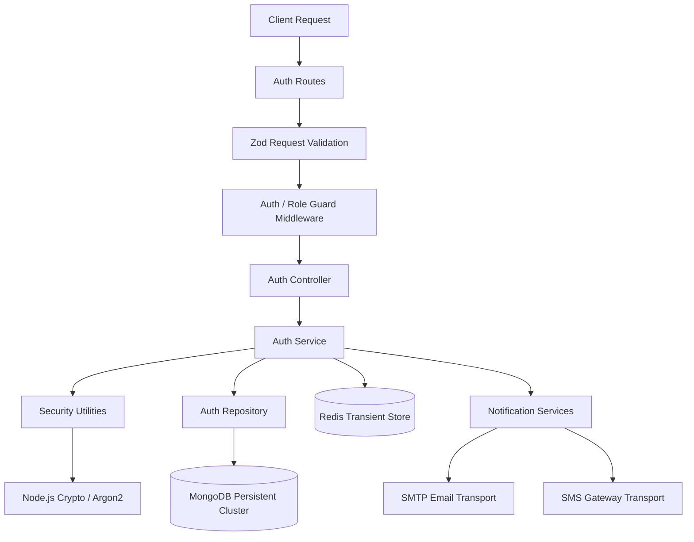

# Authentication Module Architecture Specification

## Smart Auditorium Booking & Management System (SABMS)

---

## 1. Architectural Structure

The Authentication module resides in the modular monolith under `server/src/modules/auth/`. The target structural layout planned for Sprint 2 implementation is organized as follows:

```text
server/src/modules/auth/
├── auth.routes.js               # Route declarations & validation/auth middleware attachments
├── auth.controller.js           # HTTP request parsing, service invocation & response dispatch
├── auth.service.js              # Business logic, orchestration, security enforcement
├── auth.repository.js           # Authentication-specific persistence queries & user lookups
├── auth.schema.js               # Zod validation schemas for auth request bodies/queries
├── auth.constants.js            # Module constants (token lifetimes, OTP limits, cookie keys)
├── auth.helper.js               # Formatting & device header extraction helpers
└── auth.response.js             # DTO transformers for sanitizing outgoing user objects

server/src/services/
├── password.service.js          # Password hashing, salting, constant-time verification
├── email.service.js             # (Sprint 2.5) Email transport service
└── otp.service.js               # (Sprint 2.5) OTP orchestration service
```

> **Important Boundary Rule**: The `auth` module is flat and contains exactly 8 files. Cryptographic utilities like `password.service.js` reside under `server/src/services/`, while shared models like `user.model.js` reside under `server/src/modules/users/`.

---

## 2. Layer Responsibility Boundaries

To maintain high maintainability and security, strict rules govern each architectural layer:



### 2.1 Auth Routes (`auth.routes.js`)

- **May**: Define HTTP methods, URI paths, and bind validation/guard middlewares.
- **Must Not**: Contain business logic, database queries, password hashing, or token generation.
- **Dependencies**: Express `Router`, Zod validation middleware, Auth guard middleware, Auth controller.

### 2.2 Auth Controller (`auth.controller.js`)

- **May**: Parse incoming request parameters, cookies, and headers (e.g., User-Agent, IP); invoke corresponding service methods; return standardized responses using `res.success()`, `res.created()`, etc.; set/clear `HttpOnly` refresh cookies.
- **Must Not**: Directly query MongoDB or Redis; perform password hashing; generate OTPs; generate JWT tokens; send emails/SMS.
- **Dependencies**: `auth.service.js`, `apiResponse.js`, `AppError.js`.

### 2.3 Auth Service (`auth.service.js`)

- **May**: Implement core business logic and workflows; enforce authentication policies; orchestrate repository calls, security utilities, Redis cache operations, and notification triggers.
- **Must Not**: Interact with HTTP request/response objects (`req`, `res`); execute raw Mongoose database queries directly (must delegate to Repository); parse Express routing params.
- **Dependencies**: `auth.repository.js`, `password.service.js`, `token.security.js`, `otp.service.js`, `session.security.js`, Redis client, Email/SMS services.

### 2.4 Auth Repository (`auth.repository.js`)

- **May**: Execute Mongoose queries (`findOne`, `create`, `updateOne`); manage database transactions; abstract database schema interactions.
- **Must Not**: Handle HTTP concerns; generate tokens; hash passwords; send notifications.
- **Dependencies**: `user.model.js`, `Role.model.js`, `Session.model.js`.

### 2.5 Core Services & Cryptographic Utilities (`server/src/services/`)

- **`password.service.js`**: Cryptographic password hashing and constant-time verification using Argon2id. _Note: Complexity validation is strictly handled in Zod schemas._
- **`otp.service.js`** (Sprint 2.5): Cryptographically secure 6-digit numeric generator (`crypto.randomInt()`) and SHA-256/HMAC hashing for safe storage.

### 2.6 Persistence & State Infrastructure

- **MongoDB (Persistent State)**:
  - Long-term storage of user accounts, role definitions, email/phone verification status, and password hashes.
- **Redis (Ephemeral State & Fast TTL)**:
  - OTP verification codes and attempt throttles.
  - Refresh token rotation families and active session indexes.
  - Failed login attempt counters and account lockout locks.
  - IP and account rate-limiting counters.
  - Revoked JWT token identifiers (JTI blocklist).

---

## 3. Token Architecture

The authentication system employs a **Dual-Token Strategy** to balance API performance and session security.

```text
┌───────────────────────────────────────────────────────────────────────────┐
│                           DUAL-TOKEN SYSTEM                               │
├─────────────────────────────────────┬─────────────────────────────────────┤
│            ACCESS TOKEN             │            REFRESH TOKEN            │
├─────────────────────────────────────┼─────────────────────────────────────┤
│ Format: JSON Web Token (JWT)        │ Format: Opaque Random String        │
│ Entropy: Signed HMAC-SHA256         │ Entropy: 64-byte CSPRNG hex string  │
│ Lifespan: ~15 Minutes (Short-lived) │ Lifespan: ~7 Days (Long-lived)      │
│ Transmission: Authorization Header  │ Transmission: HttpOnly Secure Cookie│
│ Storage: Client In-Memory (Zustand) │ Storage: Browser Cookie Store       │
│ Purpose: Stateless API Request Auth │ Purpose: Session Token Renewal      │
└─────────────────────────────────────┴─────────────────────────────────────┘
```

### 3.1 Access Token (JWT)

- **Token Claims**:
  ```json
  {
    "sub": "64a7f8e9c1d2e3f4a5b6c7d8",
    "role": "FACULTY",
    "sessionId": "sess_9f8a7b6c5d4e3f2a1b0c",
    "jti": "jti_1a2b3c4d5e6f7a8b9c0d",
    "iat": 1770000000,
    "exp": 1770000900
  }
  ```
- **Transmission**: Sent on every API request as:
  ```http
  Authorization: Bearer <access_token>
  ```
- **Design Rationale**: Short lifespan limits window of vulnerability if intercepted. Stateless verification avoids database lookup on every request, with Redis JTI blocklist consulted only for immediate revocation. Sensitive PII is omitted from claims.

### 3.2 Refresh Token (Opaque Token with Single-Use Rotation)

- **Structure**: 64-byte cryptographically secure random string (`crypto.randomBytes(64).toString('hex')`).
- **Storage & Transmission**:
  ```http
  Set-Cookie: refreshToken=<token_value>; Path=/api/v1/auth; HttpOnly; Secure; SameSite=Strict; Max-Age=604800
  ```
- **Single-Use Rotation & Theft Detection**:
  1. Every refresh request consumes the existing refresh token and generates a new access/refresh token pair.
  2. The old refresh token is marked as consumed in Redis.
  3. **Reuse Detection**: If an already-consumed refresh token is presented, the system detects a token replay/theft attack and immediately revokes the **entire token family** (invalidating all active sessions for that user).

---

## 4. Session Architecture

SABMS supports concurrent multi-device logins while maintaining granular administrative and user control.

```text
User Account (MongoDB)
  ├── Active Session 1 (Desktop Chrome, IP: 192.168.1.10)  ──> Redis Session State (TTL: 7d)
  ├── Active Session 2 (Mobile Safari,  IP: 10.0.0.5)     ──> Redis Session State (TTL: 7d)
  └── Active Session 3 (Tablet Firefox, IP: 172.16.0.2)    ──> Redis Session State (TTL: 7d)
```

- **Session Context**:
  - `sessionId`: Unique identifier (`sess_<uuid>`).
  - `userId`: Reference to User ObjectId.
  - `ipAddress`: Client IP address for anomaly detection.
  - `userAgent`: Browser and OS metadata.
  - `deviceFingerprint`: Hash of client device characteristics.
  - `createdAt`: Session initiation timestamp.
  - `lastActivityAt`: Timestamp of last token renewal.
  - `status`: `active` | `revoked` | `expired`.
- **Session Lifecycle Operations**:
  - **Single Device Logout**: Revokes the specific `sessionId` and cleans up the corresponding refresh token family in Redis.
  - **Global Logout ("Logout from all devices")**: Invalidates all active session keys and token families for the user in Redis and updates `tokenVersion` on the User document.
  - **Password Change / Reset**: Automatically triggers global session revocation to prevent persistent access by unauthorized actors.

---

## 5. Canonical OTP Verification Architecture

**Decision**: **OTP (Email and Phone)** is the canonical identity verification mechanism for Sprint 2.

```text
┌───────────────────────────────────────────────────────────────────────────┐
│                       CANONICAL OTP SPECIFICATION                         │
├───────────────────────┬───────────────────────────────────────────────────┤
│ Format                │ 6-digit numeric string (000000 – 999999)          │
│ Generation Primitive  │ crypto.randomInt(100000, 1000000).toString()      │
│ Lifespan (TTL)        │ 5 Minutes (300 seconds)                           │
│ Storage               │ Redis ephemeral key: otp:<type>:<identifier>      │
│ Stored Value          │ SHA-256/HMAC Hash (Plaintext NEVER stored)        │
│ Verification Attempts │ Maximum 5 attempts (Invalidated on 5th failure)   │
│ Resend Throttling     │ Minimum 60s cooldown; Maximum 3 resends per hour  │
│ Post-Verification     │ Key immediately deleted upon successful match     │
└───────────────────────┴───────────────────────────────────────────────────┘
```

> **Legacy Documentation Reference**: Magic verification link flows (SD-02, SD-10) are retained as optional/legacy reference architecture and are **not** part of the canonical Sprint 2 verification pipeline.

---

## 6. Redis State Management & TTL Strategy

Redis is dedicated to managing high-speed, transient authentication state with strict automatic expiration policies:

| Redis Key Pattern      | Purpose                                         | Data Type        | TTL                    |
| :--------------------- | :---------------------------------------------- | :--------------- | :--------------------- |
| `otp:email:<email>`    | Email verification OTP hash & attempts          | Hash / String    | 5 Minutes (`300s`)     |
| `otp:phone:<phone>`    | Phone verification OTP hash & attempts          | Hash / String    | 5 Minutes (`300s`)     |
| `otp:resend:<id>`      | Resend cooldown and rate limit counter          | String / Integer | 1 Hour (`3600s`)       |
| `session:<sessionId>`  | Active session metadata & rotation state        | Hash             | 7 Days (`604800s`)     |
| `rt:family:<familyId>` | Refresh token family status & active token hash | Hash             | 7 Days (`604800s`)     |
| `lockout:<email>`      | Account lockout counter & lock flag             | Integer          | 15–30 Minutes          |
| `rl:auth:ip:<ip>`      | Authentication endpoint IP rate limiter counter | Integer          | 15 Minutes (`900s`)    |
| `bl:jti:<jti>`         | Revoked JWT access token blocklist              | String           | Remaining JWT Lifetime |

---

## 7. Security Boundaries & Zero-Trust Policy

```text
┌───────────────────────────────────────────────────────────────────────────┐
│                        ZERO-TRUST REDACTION RULES                         │
├───────────────────────────────────────────────────────────────────────────┤
│ ❌ NEVER Log or Expose:                                                   │
│    • Plaintext user passwords                                             │
│    • Plaintext OTP codes                                                  │
│    • JWT signing secrets or private keys                                  │
│    • Raw refresh token strings                                            │
│    • SMTP passwords, SMS gateway API keys, or Redis credentials           │
│    • Database connection strings containing credentials                   │
├───────────────────────────────────────────────────────────────────────────┤
│ ✔️ ALWAYS Include in Structured Audit Logs:                               │
│    • Correlation Request ID (`requestId`)                                 │
│    • Masked User Identifier (`userId`)                                    │
│    • Client IP address and sanitized User-Agent                           │
│    • Event Type (`AUTH_LOGIN_SUCCESS`, `AUTH_OTP_SENT`, etc.)             │
│    • Timestamp (ISO 8601 UTC)                                             │
└───────────────────────────────────────────────────────────────────────────┘
```

---

## 8. Module Dependency Boundaries & Circular Dependency Prevention

To preserve the modular monolith architecture without circular dependencies, the `auth` module interacts with other domains through strictly one-way boundaries:

```text
                   ┌────────────────────────┐
                   │  server/src/shared/constants  │  (Shared Enums & Constants)
                   └───────────┬────────────┘
                               │
            ┌──────────────────┴──────────────────┐
            ▼                                     ▼
┌───────────────────────┐             ┌───────────────────────┐
│  server/src/modules/  │             │  server/src/modules/  │
│         auth          │             │        users          │
└───────────┬───────────┘             └───────────┬───────────┘
            │ (Publishes Domain Events)           │
            ▼                                     │
┌───────────────────────┐                         │
│  Domain Event Bus /   │                         │
│  Notification Service │ ◄───────────────────────┘
└───────────────────────┘
```

- **Rules**:
  - `auth` module queries its own repository (`auth.repository.js`) to resolve authentication credentials.
  - `users` module manages general user profiles, preferences, and avatar updates.
  - Cross-module actions (e.g., booking approvals, notification triggers) communicate via explicit service interfaces or internal domain events, preventing `auth → users → auth` circular loops.

---

## 9. Current (Sprint 1) vs Target (Sprint 2) State Matrix

| Component             | Current Sprint 1 State | Target Sprint 2 Implementation                     | Scheduled Task    |
| :-------------------- | :--------------------- | :------------------------------------------------- | :---------------- |
| **Auth Routes**       | Placeholder endpoints  | Validated production endpoints with controllers    | Sprint 2.4+       |
| **User Model**        | Not implemented        | Mongoose User Schema with indexes & hooks          | Sprint 2.2        |
| **Role Model**        | Not implemented        | Mongoose Role & Permission Matrix Schema           | Sprint 2.2        |
| **Session Model**     | Not implemented        | Persistent session audit & device index Schema     | Sprint 2.16       |
| **Auth Repository**   | Not implemented        | Query encapsulation for MongoDB User/Role/Session  | Sprint 2.2+       |
| **Auth Service**      | Not implemented        | Core auth business logic & orchestration           | Sprint 2.4+       |
| **Auth Controller**   | Not implemented        | HTTP parameter parsing & response formatting       | Sprint 2.4+       |
| **Password Security** | Not implemented        | Argon2/bcrypt cryptographic hashing utility        | Sprint 2.3        |
| **OTP Security**      | Validators only        | CSPRNG numeric generator & Redis HMAC storage      | Sprint 2.5, 2.6   |
| **Token Security**    | Error normalizers only | JWT Access Token signing & claim verification      | Sprint 2.8, 2.9   |
| **Session Security**  | Not implemented        | Multi-device session manager & token rotation      | Sprint 2.10, 2.16 |
| **Redis Store**       | Not implemented        | ioredis client & transient state helpers           | Sprint 2.5+       |
| **Email Transport**   | Env placeholders only  | Nodemailer SMTP transactional mailer               | Sprint 2.5, 2.12  |
| **SMS Transport**     | Not implemented        | SMS gateway client for mobile OTP delivery         | Sprint 2.6        |
| **Auth Middleware**   | Not implemented        | `authenticate`, `requireRole`, `requirePermission` | Sprint 2.8        |
