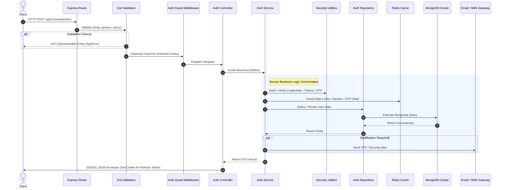

# Authentication Flows & Sequence Diagram Mapping

## Smart Auditorium Booking & Management System (SABMS)

---

## 1. Target Request Processing Flow

Every authentication request follows a deterministic pipeline through the layered architecture:



### 1.1 Standard Failure & Error Flow

```text
Domain / Infrastructure Failure
  ↓
Thrown AppError (or normalized third-party error via errorHandler)
  ↓
catchAsync Wrapper forwards to next(err)
  ↓
Global Error Handler Middleware (server/src/middleware/errorHandler.middleware.js)
  ↓
Structured Winston Error Log (with requestId, timestamp, statusCode, stack)
  ↓
Sanitized JSON Response to Client (No stack traces or internal secrets in production)
```

---

## 2. Sequence Diagram Mapping (SD-01 through SD-17)

Below is the complete mapping of all 17 system sequence diagrams to the SABMS Authentication Architecture and Sprint 2 tasks.

---

### SD-01: User Registration

- **Purpose**: New user account creation with default `STUDENT` role and `PENDING` status.
- **Components**: `auth.routes.js`, `auth.controller.js`, `auth.service.js`, `password.security.js`, `User.repository.js`, `User.model.js`, `auth.schema.js`, `auth.response.js`.
- **Workflow**: Validates input fields via strict Zod schema → Normalizes email address → Performs application-level duplicate email check → Hashes password using Argon2id via `password.security.js` → Persists user with `role: STUDENT`, `status: PENDING`, `isEmailVerified: false`, `isPhoneVerified: false` via `UserRepository.create()` → Returns sanitized HTTP 201 response. (Verification initiation boundary maintained; canonical Email OTP dispatch and verification deferred to Sprint 2.5).
- **Attributes**: Uses OTP (`Sprint 2.5+`), Access Token (`No`), Refresh Token (`No`), Sessions (`No`), Notifications (`Sprint 2.5+`).
- **Sprint 2 Task**: **Sprint 2.4** (Registration).

---

### SD-02: Email Verification (Magic Link) `[OPTIONAL / LEGACY REFERENCE]`

- **Purpose**: Verify account using tokenized URL link.
- **Status**: **Optional / Legacy Reference Architecture**. (Canonical verification is **SD-16: Email OTP**).
- **Components**: `auth.routes.js`, `auth.controller.js`, `auth.service.js`, `auth.repository.js`, `User.model.js`.
- **Sprint 2 Task**: Optional reference.

---

### SD-03: User Login

- **Purpose**: Authenticate user credentials and establish a secure session.
- **Components**: `auth.routes.js`, `auth.controller.js`, `auth.service.js`, `password.security.js`, `auth.repository.js`, `User.model.js`, `token.security.js`, `session.security.js`, `Redis`.
- **Workflow**: Validates login credentials → Checks account lockout state in Redis → Verifies password hash via constant-time comparison → Checks verification status (`isEmailVerified`) → Generates Access Token (JWT) & Refresh Token (64-byte opaque) → Registers session in Redis (7d TTL) → Returns Access Token in body and sets `HttpOnly` Refresh Cookie.
- **Attributes**: Uses OTP (`No`), Access Token (`Yes`), Refresh Token (`Yes`), Sessions (`Yes`), Notifications (`No`).
- **Sprint 2 Task**: **Sprint 2.7** (Login).

---

### SD-04: Forgot Password

- **Purpose**: Initiate password recovery workflow for a registered account.
- **Components**: `auth.routes.js`, `auth.controller.js`, `auth.service.js`, `auth.repository.js`, `otp.security.js`, `Redis`, `Email Service`.
- **Workflow**: Validates email → Queries user without exposing existence (prevents account enumeration) → Generates 6-digit password reset OTP → Stores hashed OTP in Redis with rate limit counter → Dispatches OTP via Email.
- **Attributes**: Uses OTP (`Yes`), Access Token (`No`), Refresh Token (`No`), Sessions (`No`), Notifications (`Yes - Email`).
- **Sprint 2 Task**: **Sprint 2.12** (Forgot Password).

---

### SD-05: Reset Password

- **Purpose**: Finalize password update using verified reset OTP.
- **Components**: `auth.routes.js`, `auth.controller.js`, `auth.service.js`, `otp.security.js`, `password.security.js`, `auth.repository.js`, `User.model.js`, `session.security.js`, `Redis`, `Email Service`.
- **Workflow**: Validates new password & OTP → Verifies OTP against Redis hash → Hashes new password → Updates User record in MongoDB → Triggers **Global Session Revocation** in Redis → Sends confirmation email.
- **Attributes**: Uses OTP (`Yes`), Access Token (`No`), Refresh Token (`No`), Sessions (`Yes - Invalidation`), Notifications (`Yes - Email`).
- **Sprint 2 Task**: **Sprint 2.13** (Reset Password).

---

### SD-06: User Logout

- **Purpose**: Terminate current client session and invalidate credentials.
- **Components**: `auth.routes.js`, `auth.controller.js`, `auth.service.js`, `session.security.js`, `Redis`.
- **Workflow**: Extracts `sessionId` from request/cookie → Deletes session and refresh token family keys from Redis → Adds access token JTI to Redis blocklist (for remaining TTL) → Clears client `HttpOnly` refresh cookie.
- **Attributes**: Uses OTP (`No`), Access Token (`Yes`), Refresh Token (`Yes`), Sessions (`Yes`), Notifications (`No`).
- **Sprint 2 Task**: **Sprint 2.11** (Logout).

---

### SD-07: Refresh Access Token

- **Purpose**: Issue new Access Token using valid Refresh Cookie with single-use rotation.
- **Components**: `auth.routes.js`, `auth.controller.js`, `auth.service.js`, `token.security.js`, `session.security.js`, `Redis`.
- **Workflow**: Reads `refreshToken` cookie → Verifies token existence in Redis → **If valid**: Rotates refresh token (issues new 64-byte opaque token + new JWT access token, updates family state in Redis, sets new cookie) → **If reused/stolen**: Immediately revokes entire token family (theft detection).
- **Attributes**: Uses OTP (`No`), Access Token (`Yes`), Refresh Token (`Yes`), Sessions (`Yes`), Notifications (`No`).
- **Sprint 2 Task**: **Sprint 2.9 & 2.10** (Refresh Token & Token Rotation).

---

### SD-08: Change Password

- **Purpose**: Authenticated user updates their account password.
- **Components**: `auth.routes.js`, `auth.middleware.js`, `auth.controller.js`, `auth.service.js`, `password.security.js`, `auth.repository.js`, `session.security.js`, `Redis`, `Email Service`.
- **Workflow**: Verifies active JWT session → Verifies current password against stored hash → Hashes new password → Updates MongoDB → Revokes all other active user sessions in Redis (preserves or refreshes current session) → Dispatches security notice email.
- **Attributes**: Uses OTP (`No`), Access Token (`Yes`), Refresh Token (`Yes`), Sessions (`Yes`), Notifications (`Yes - Email`).
- **Sprint 2 Task**: **Sprint 2.14** (Change Password).

---

### SD-09: Resend Verification Email (Resend OTP)

- **Purpose**: Re-issue verification OTP when previous code expires or is lost.
- **Components**: `auth.routes.js`, `auth.controller.js`, `auth.service.js`, `otp.security.js`, `Redis`, `Email/SMS Service`.
- **Workflow**: Validates recipient identifier → Checks resend cooldown in Redis (60s minimum interval, max 3/hour) → Generates new 6-digit OTP → Overwrites Redis OTP key with refreshed 5 min TTL → Dispatches new OTP.
- **Attributes**: Uses OTP (`Yes`), Access Token (`No`), Refresh Token (`No`), Sessions (`No`), Notifications (`Yes`).
- **Sprint 2 Task**: **Sprint 2.15** (Resend OTP).

---

### SD-10: Verify Email with Token `[OPTIONAL / LEGACY REFERENCE]`

- **Purpose**: Legacy token-based query link verification.
- **Status**: **Optional / Legacy Reference Architecture**.
- **Sprint 2 Task**: Optional reference.

---

### SD-11: JWT Authentication Middleware

- **Purpose**: Protect API routes by verifying access tokens and injecting user context.
- **Components**: `auth.middleware.js`, `token.security.js`, `Redis`, `auth.repository.js`, `User.model.js`.
- **Workflow**: Extracts `Bearer <token>` from `Authorization` header → Verifies JWT signature and expiry → Checks Redis JTI blocklist → Validates user active status in cache/DB → Attaches `{ id, role, sessionId }` to `req.user` → Calls `next()`.
- **Attributes**: Uses OTP (`No`), Access Token (`Yes`), Refresh Token (`No`), Sessions (`Yes`), Notifications (`No`).
- **Sprint 2 Task**: **Sprint 2.8** (Auth Middleware).

---

### SD-12: Session Expiration & Automatic Refresh

- **Purpose**: Client transparently refreshes expired access token without user disruption.
- **Components**: Frontend Axios Interceptor, `auth.routes.js`, `auth.service.js`, `Redis`.
- **Workflow**: Client receives 401 on expired access token → Interceptor pauses requests → Calls `POST /api/v1/auth/refresh` → Receives new access token → Retries original failed request.
- **Attributes**: Uses OTP (`No`), Access Token (`Yes`), Refresh Token (`Yes`), Sessions (`Yes`), Notifications (`No`).
- **Sprint 2 Task**: **Sprint 2.9 & 2.16** (Refresh & Session Lifecycle).

---

### SD-13: Account Lock After Failed Login Attempts

- **Purpose**: Defend against automated credential stuffing and brute-force password guessing.
- **Components**: `auth.service.js`, `Redis`, `Email Service`.
- **Workflow**: On invalid password attempt, increments Redis failure counter (`lockout:<email>`) with 15 min TTL → If count exceeds threshold (5 attempts), sets lock status → Rejects subsequent attempts with 429 Too Many Requests / 423 Locked → Sends account security alert email.
- **Attributes**: Uses OTP (`No`), Access Token (`No`), Refresh Token (`No`), Sessions (`No`), Notifications (`Yes - Email`).
- **Sprint 2 Task**: **Sprint 2.7 & 2.17** (Login & Rate Limiting).

---

### SD-14: Account Unlock

- **Purpose**: Restore locked account automatically after TTL or via admin intervention.
- **Components**: `auth.service.js`, `Redis`, `auth.repository.js`.
- **Workflow**: Automatic: Redis key expires after 15–30 minutes. Manual: Admin executes unlock endpoint clearing Redis lockout key and resetting failure counter.
- **Attributes**: Uses OTP (`Optional`), Access Token (`Admin JWT`), Refresh Token (`No`), Sessions (`No`), Notifications (`Yes`).
- **Sprint 2 Task**: **Sprint 2.17** (Rate Limits & Account Lock).

---

### SD-15: Session Validation

- **Purpose**: Verify that an active session has not been revoked or hijacked.
- **Components**: `auth.middleware.js`, `session.security.js`, `Redis`.
- **Workflow**: Inspects incoming request `sessionId` → Verifies active session hash in Redis → Validates IP subnet and User-Agent fingerprint consistency → Updates `lastActivityAt` timestamp in Redis.
- **Attributes**: Uses OTP (`No`), Access Token (`Yes`), Refresh Token (`No`), Sessions (`Yes`), Notifications (`No`).
- **Sprint 2 Task**: **Sprint 2.16** (Session Security).

---

### SD-16: OTP Verification — Email `[CANONICAL]`

- **Purpose**: Canonical email address verification for registration and account recovery.
- **Components**: `auth.routes.js`, `auth.controller.js`, `auth.service.js`, `otp.security.js`, `Redis`, `auth.repository.js`, `User.model.js`.
- **Workflow**: User submits `{ email, otp }` → Service fetches hashed OTP and attempt counter from Redis → Verifies constant-time hash match → If invalid: increments attempt counter (invalidates on 5th attempt) → If valid: marks `isEmailVerified: true` on User document, deletes Redis OTP key → Dispatches welcome / confirmation event.
- **Attributes**: Uses OTP (`Yes`), Access Token (`No`), Refresh Token (`No`), Sessions (`No`), Notifications (`Yes`).
- **Sprint 2 Task**: **Sprint 2.5** (Email OTP Verification).

---

### SD-17: OTP Verification — Phone `[CANONICAL]`

- **Purpose**: Canonical mobile phone number verification.
- **Components**: `auth.routes.js`, `auth.controller.js`, `auth.service.js`, `otp.security.js`, `Redis`, `auth.repository.js`, `User.model.js`.
- **Workflow**: User submits `{ phone, otp }` → Service fetches phone OTP hash from Redis → Validates match and attempt limit → If valid: marks `isPhoneVerified: true` on User document, deletes Redis OTP key.
- **Attributes**: Uses OTP (`Yes`), Access Token (`No`), Refresh Token (`No`), Sessions (`No`), Notifications (`Yes - SMS`).
- **Sprint 2 Task**: **Sprint 2.6** (Phone OTP Verification).
